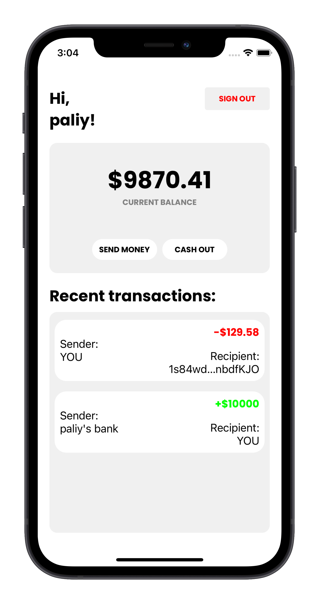
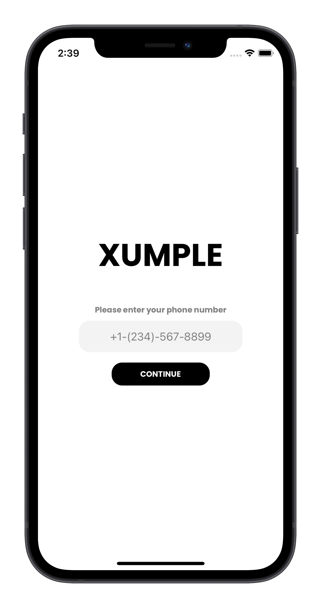

Simple iOS Application with its own server to transfer money using Stellar TestNet.

<p align="center">
  
&nbsp; &nbsp; &nbsp; &nbsp;
  
</p>

## HOW TO USE?

1. Install Go [LINK](https://golang.org/).
2. Register an account at [LINK](https://www.twilio.com/).
3. Obtain ```ACCOUNT SID, AUTH TOKEN, and Twillio Phone Number``` and insert it into ```./controllers/authcontroller/otp.go```
4. Run ```go run main.go``` in your terminal.
5. Launch Xumple-mobile project and test the app!

TESTING:
To generate random users use this command ```curl http://localhost:8080/test/generate-random-users?count=10```

```
   Copyright 2021 VITALIY PALIY

   Licensed under the Apache License, Version 2.0 (the "License");
   you may not use this file except in compliance with the License.
   You may obtain a copy of the License at

       http://www.apache.org/licenses/LICENSE-2.0

   Unless required by applicable law or agreed to in writing, software
   distributed under the License is distributed on an "AS IS" BASIS,
   WITHOUT WARRANTIES OR CONDITIONS OF ANY KIND, either express or implied.
   See the License for the specific language governing permissions and
   limitations under the License.

```
